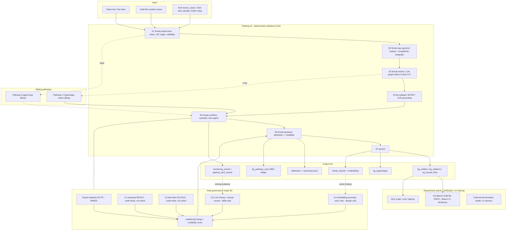

# Hybrid Rule Governance: Expert Baseline + Adaptive Layers C1-C4, Replayable

## 1. Verified status of the four adaptive layers

Checked in the current tree:

| Layer | Code present | Imported by the live pipeline | Verdict |
|---|---|---|---|
| C1 Temporal (R8-R12) | `src/lib/conflicts/temporal-rules.ts` | Only by `__tests__/temporal-killchain.test.ts` | Code-complete, NOT wired |
| C2 Kill-chain (R13-R15) | `src/lib/conflicts/killchain-rules.ts` | Only by the same test file | Code-complete, NOT wired |
| C3 LLM rule mining + HITL | Table `kg_conflict_rule_candidates` (migrated, RLS + GRANTs) and empty sink `src/lib/conflicts/mined-rules.generated.ts` | No producer, no review UI, `MINED_RULES` is `[]` | Schema only |
| C4 Embedding anomaly | None | None | Design only |

`supabase/functions/threat-conflicts/index.ts` currently runs only the expert baseline R1-R7 plus the Pathway C hyperedge block. So the answer is: the four layers are **partially** constructed - two are written and unit-tested but bypassed at runtime, one has only persistence, one does not exist.

## 2. Total architecture (as-is, with honest status labels)

## 3. Implementation plan - replayable hybrid rule governance

Goal: expert baseline rules and the auto-generated adaptive rules jointly produce the KG, and every KG output can be replayed against the exact rule set that produced it.

### G1 - Shared rule kernel (unblocks everything)
Edge functions cannot import from `src/`. Copy the rule logic into `supabase/functions/_shared/rules/` (`temporal.ts`, `killchain.ts`, `mined.generated.ts`, plus a `registry.ts` that exports every rule with `{rule_id, layer, taxonomy, provenance: "expert" | "adaptive" | "mined", severity}`). Keep `src/lib/conflicts/*` as the browser-side mirror re-exporting the same shapes so existing tests stay green.

### G2 - Wire C1 and C2 into the live path
In `threat-conflicts/index.ts`, run `runTemporalRules` and `runKillChainRules` after R1-R7 and concatenate into the existing `violations[]`. Response shape is unchanged (`summary.passed/warnings/failures` and `violations[]` already exist), so the stage contract holds. Each violation gains `layer` and `provenance` fields.

### G3 - Rule-set versioning and replay manifest
New table `kg_rule_sets`: `id, version, created_at, rules jsonb (full registry snapshot), notes`. Every conflicts run resolves the active rule set, stamps `rule_set_version` into the response, and `kg_pathway_runs` / `monitoring_events` record it. A new `replayRun(runId)` helper re-executes the deterministic rule layers against the stored extraction using the archived rule snapshot and diffs the violation set - this is what makes the hybrid output auditable and reproducible.

### G4 - C3 mining loop closed
New edge function `threat-conflicts-mine`: reads recent `monitoring_events` + validated extractions, asks the model (AI SDK, `Output.object`, small schema) for candidate rules `{when, then, rationale, confidence}`, writes them to `kg_conflict_rule_candidates` with `status = 'proposed'`. New `RuleGovernancePanel` on the KG Construction page lists candidates with accept / reject / note; accepting flips status to `accepted` and appends the compiled predicate into `mined.generated.ts` plus a new rule-set version. Mined rules carry lower weight than expert rules in the credibility score.

### G5 - C4 embedding anomaly (warn only)
In `threat-rag`, compute the mean edge-pattern vector for a new extraction and compare against the historical distribution derived from `threat_reports.embedding`; flag `warn` beyond mu + 3 sigma. Never blocks persistence; surfaces as a distinct violation type.

### G6 - Provenance-weighted credibility
Credibility score becomes a weighted penalty over violations, weighted by rule provenance (expert > adaptive deterministic > mined) and by severity. Exposed in the UI so a reviewer can see which layer drove a downgrade.

### G7 - Bench + docs
Add a `conflict_adaptivity` KG-Bench category with gold cases for R8-R15, bump `GOLD_VERSION` v2 -> v3, and update `public/reports/adaptive-layers-clarification.md` and the roadmap so status tables match reality.

## 4. Technical notes

- Stage contract for `threat-conflicts` keeps its documented response shape; only additive fields (`layer`, `provenance`, `rule_set_version`) are introduced, so `use-threat-pipeline.ts`, `AgentLoopPanel.tsx` and `kg-bench/runner.ts` need no breaking change.
- New tables `kg_rule_sets` (and any candidate-audit additions) get explicit GRANTs plus RLS in the same migration, matching the existing research-demo posture.
- No model fine-tuning anywhere: C3 uses the frozen gateway model for proposals only, and human acceptance is the gate.

## 5. Suggested order

G1 -> G2 -> G3 (this alone makes C1/C2 live and replayable), then G4, then G5, then G6/G7.
