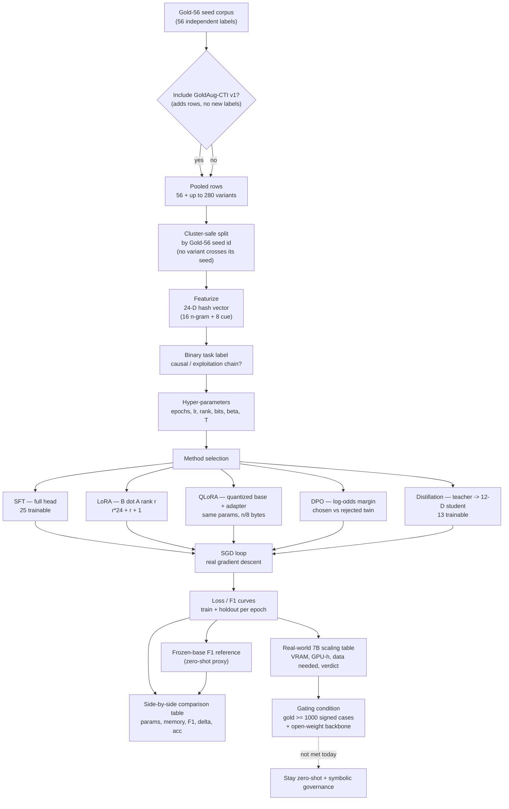

# Fine-Tuning Simulation Lab — Workflow

**Scope & status.** This is a **simulation-only** workflow. It runs real gradient descent on a *toy* 24-parameter linear head over a deterministic hash featurizer — it does **not** train the CTI pipeline, the extractor, the prompts, the KG, or the hosted backbone. The CTI extraction path stays zero-shot on the frozen model `google/gemini-3-flash-preview`. This document is the operational companion to the feasibility analysis in [`fine-tuning-feasibility-and-simulation.md`](fine-tuning-feasibility-and-simulation.md) and is carried as an explicit carve-out in [`zero-shot-attestation.md`](zero-shot-attestation.md).

**Why a workflow doc exists at all.** The lab's behaviour was previously described conceptually in the feasibility report and implemented directly in code (`src/lib/finetune/sim.ts`, `src/pages/FineTuneLab.tsx`) with no single, self-contained, auditable description of the step sequence. This file extracts that workflow into one place with the exact code symbols and UI controls backing each step.

---

## Pipeline diagram

The diagram mirrors the actual call chain `buildDataset → train → TrainResult` in `sim.ts` and the four-tab UI in `FineTuneLab.tsx`.

A downloadable copy of this diagram is at `Finetune_Lab_Workflow.mmd`.

---

## Step-by-step workflow

Each step lists its **purpose**, **inputs**, the **code symbol** that implements it, and the **UI control** that drives it.

### Step 1 — Dataset construction
- **Purpose.** Build a train/holdout set from the gold corpus, with a leakage guard that prevents any GoldAug variant from appearing on the opposite side of its seed.
- **Inputs.** `sampleTestCases` (Gold-56) and, optionally, `augmentedVariants` (GoldAug-CTI v1). Holdout fraction and seed.
- **Code.** `buildDataset()` in `sim.ts` → returns `Example[]` (id, seedId, derived, text, x, y, split). Labels come from `labelOf()` (causal link or exploitation-shaped relation → y=1). `datasetStats()` reports totals.
- **UI.** *Dataset prep* tab — `Include GoldAug` switch, *Holdout fraction* slider (0.10–0.50), *Seed* slider (1–99). Live stat tiles: Rows, Train, Holdout, Derived, Independent labels, Positive rate.
- **Output.** A `Example[]` split where the `seedId` cluster is the atomic unit of the train/holdout boundary.

### Step 2 — Hyper-parameters
- **Purpose.** Configure the single SGD run shared by all five methods (the methods consume the same hyper-set but interpret the relevant subset).
- **Inputs.** Epochs, learning rate, LoRA rank, QLoRA bit-width, DPO β, distillation temperature.
- **Code.** `TrainOptions` interface + the `train()` dispatch in `sim.ts`. The frozen base `frozenBase()` (cue prior `w[i]=0.6`, `b0=-0.15`) is the zero-shot proxy; `quantize()` fake-quantises the base for QLoRA; the LoRA scaling `scale = 1/max(1,rank)` keeps the adapter step rank-independent.
- **UI.** *Adaptation runs* tab — six sliders (Epochs 5–80, LR 0.05–1, rank 1–12, bits 2–8, β 0.05–1, T 1–6).
- **Output.** A `TrainOptions` bundle passed to `train()`.

### Step 3 — Method runs (the SGD loop)
- **Purpose.** Execute real gradient descent for each chosen technique so loss curves, overfitting, and adapter dynamics are *observed*, not scripted.
- **Per-method mechanics** (carried from the feasibility report):

  | Method | What is frozen | What is learned | Trainable params (toy) |
  |---|---|---|---|
  | **SFT** | nothing | full 24-D head + bias | 25 |
  | **LoRA** | base head | rank-r `B·A` product, `B` zero-init | r·24 + r + 1 |
  | **QLoRA** | base head (fake-quantised to n bits) | same adapter as LoRA | r·24 + r + 1, base at n/8 bytes |
  | **DPO** | head (updated indirectly) | log-odds margin between chosen & corrupted-rejected twin, anchored by half-weight label term | 25 |
  | **Distillation** | teacher (trained first) then frozen | 12-feature student fitting temperature-softened teacher outputs | 13 |

- **Code.** `train()` in `sim.ts`. For each epoch it does the per-method update (SFT full update / LoRA-QLoRA `Bv`+`A` update / DPO margin+anchor / distill teacher-then-student), then evaluates `f1()` and `bce()` on both splits and pushes a `Curve` row.
- **UI.** *Adaptation runs* tab — five per-method **Run** buttons plus **Run all five**. Each completed method renders a loss/F1 line chart (train loss, holdout loss, holdout F1) and a 4-tile readout (Base F1, Final F1, Δ, wall time).
- **Output.** A `TrainResult` per method: `curve[]`, `trainableParams`, `memoryBytes`, `finalF1`, `finalAcc`, `baselineF1`, `delta`, `seconds`.

### Step 4 — Method comparison
- **Purpose.** Compare the methods on a common run: parameter budget vs. memory vs. holdout gain, and the delta against the frozen-base (zero-shot proxy) F1.
- **Inputs.** The `TrainResult` objects produced in Step 3.
- **Code.** `TrainResult` fields (`trainableParams`, `bytesPerParam*8`, `memoryBytes`, `finalF1`, `delta`, `finalAcc`).
- **UI.** *Comparison* tab — table with Trainable params, Base precision, Memory (bytes), Holdout F1, Δ vs frozen base, Accuracy. Footer note: absolute numbers describe the toy head, not the CTI extractor; what transfers is the *shape* of the trade-off and how fast a 56-cluster corpus overfits.
- **Output.** The side-by-side trade-off picture.

### Step 5 — Real-world scaling projection
- **Purpose.** Show what the same recipe would cost on a real 7B open-weight backbone, so the toy results are not mistaken for production capability.
- **Inputs.** `REAL_WORLD_SCALE` constant in `sim.ts` (per-method trainable fraction, VRAM, GPU-hours, data needed, verdict).
- **UI.** *Real-world scaling* tab — table of Trainable / VRAM / Compute / Data needed / Verdict for ThreatGraph today. Footer: real adaptation becomes defensible near ~1,000 signed gold cases.
- **Output.** The honest "this is what it would take" picture, with explicit verdicts (e.g. SFT "Not viable — 56 independent labels"; LoRA/QLoRA "Viable only after gold corpus ≥ 1k").

### Step 6 — Read the results honestly & gate
- **Purpose.** Prevent the simulation from being read as evidence that the CTI extractor was fine-tuned.
- **Reading.** What transfers is the trade-off *shape*: (1) LoRA at r=4 recovers most of SFT's gain at a fraction of the params; (2) quantisation is nearly free on the frozen side until 2-bit; (3) overfitting arrives early (~42 training clusters); (4) GoldAug rows smooth the train curve without moving holdout F1 (matches `corpus-augmentation-feasibility.md`); (5) distillation trades accuracy for capacity.
- **Gate.** Real LoRA/QLoRA becomes academically defensible only when *all* hold: independent signed gold corpus ≥ ~1,000 cases, an open-weight local backbone, a recorded zero-shot baseline on the same corpus for paired (McNemar) comparison, a held-out test set never used for prompt/adapter selection, and a revised zero-shot attestation. Until then the zero-shot + symbolic-governance posture dominates on cost, reproducibility, and auditability.

---

## Reproducibility recipe

The lab is deterministic given a seed, so an auditor can re-run and land on identical curves.

1. **Fix the seed.** `rng(seed)` is a pure LCG; the same `seed` slider value reproduces the same train/holdout split and the same LoRA `A` initialisation / DPO rejected-twin noise.
2. **Frozen encoder is a hash.** `featurize()` uses an FNV-1a hash into 16 buckets plus 8 deterministic CTI cue tokens — no model call, no nondeterminism.
3. **Frozen base is fixed.** `frozenBase()` returns a constant prior; `quantize()` is deterministic given the bit-width.
4. **Real backbone is separate.** The *production* extractor runs zero-shot on `google/gemini-3-flash-preview` at temperature 0 (deterministic mode). The toy head's *free* SGD is a separate, didactic gradient process that never touches the extractor — the two are isolated by design (see §5 of `fine-tuning-feasibility-and-simulation.md`).
5. **Re-run order.** Open `/finetune-lab` → set Dataset-prep controls → set hyper-parameters → Run all five → read Comparison + Scaling tabs. Curves match across reloads for the same seed.

---

## Isolation guarantees

- No edge function, prompt, ontology, rule set, or database table is touched by the lab.
- The lab reads Gold-56 / GoldAug in the browser only; nothing is written back.
- Extraction remains zero-shot on a frozen hosted model; `zero-shot-attestation.md` carries this lab as an explicit carve-out alongside the Privacy & FL Lab.

---

## Cross-references

- [Fine-Tuning & Fitting — Feasibility and Simulation](fine-tuning-feasibility-and-simulation.md) — the "should we / can we" analysis.
- [Zero-Shot Attestation](zero-shot-attestation.md) — the carve-out that keeps the CTI pipeline training-free.
- [Corpus Augmentation Feasibility](corpus-augmentation-feasibility.md) — why GoldAug variants add rows but not independent labels.
- `Finetune_Lab_Workflow.mmd` — downloadable copy of the pipeline diagram.
