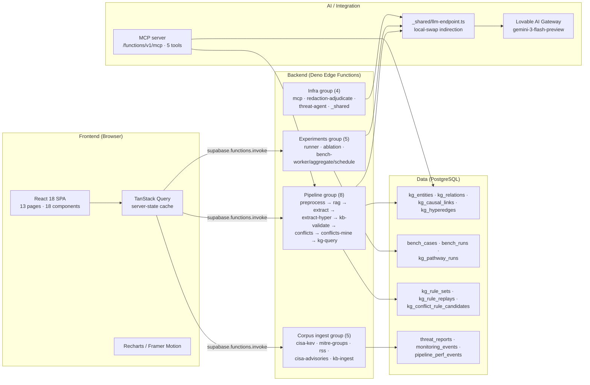

# Full-Stack Architecture Assessment — ThreatGraph

Version 1.0 · 2026-08-12
Scope: confirm whether the ThreatGraph project built on the Lovable platform is a
full-stack AI application, map every layer, and list the typical full-stack tools
each layer uses. Evidence is drawn from the live codebase (commit at time of writing).

---

## 1. Verdict

**Yes — ThreatGraph is a full-stack AI application.** It has a complete client tier
(React SPA), a complete server tier (22 Supabase Edge Functions on a Deno runtime),
a relational persistence tier (PostgreSQL with 14 domain tables and RLS), an AI tier
(Lovable AI Gateway + a local-swap indirection layer), and an integration tier (an MCP
server). All four tiers are wired together through typed request/response contracts
(`src/lib/threat-pipeline.ts` orchestrates `supabase.functions.invoke()` calls), the
frontend reads and writes backend state, and the backend persists and queries the
database — the defining property of a full-stack system. The application also exhibits
the typical full-stack tooling one expects: a component UI library, a server-state
cache, a form/validation library, an ORM-less SQL layer with row-level security, an
LLM gateway, automated tests, a linter, and a production build step.

---

## 2. Architecture diagram

---

## 3. Layer-by-layer table

| Layer | Responsibility | Typical full-stack tools | Key files |
|---|---|---|---|
| **Frontend UI** | Render dashboards, KG graph, forms, charts | React 18, TypeScript 5, Vite 5, Tailwind CSS 3, shadcn/ui (30+ Radix primitives), React Router 6 | `src/App.tsx`, `src/pages/*`, `src/components/*` |
| **Frontend state** | Cache server data, manage forms/validation | TanStack Query 5, React Hook Form 7, Zod 3, Framer Motion 12, Recharts 2 | `src/hooks/use-threat-pipeline.ts`, `src/contexts/*` |
| **Backend (Edge Functions)** | LLM extraction, conflict detection, attribution, experiments, corpus ingest | Deno runtime, Supabase Edge Functions, `fetch` to AI Gateway, AI SDK (`@ai-sdk/openai-compatible`) | `supabase/functions/*/index.ts` (22 functions) |
| **Backend shared** | LLM indirection, AI SDK provider, rule kernel | Deno modules, Vercel AI SDK | `supabase/functions/_shared/llm-endpoint.ts`, `_shared/ai-gateway.ts`, `_shared/rules/*` |
| **Data persistence** | Store KG triples, hyperedges, rules, bench runs, telemetry | PostgreSQL (Supabase), RLS policies, 10 migrations | `supabase/migrations/*` (14 `public.*` tables) |
| **AI / LLM** | Frozen zero-shot backbone; local swap supported | Lovable AI Gateway, `google/gemini-3-flash-preview`, MCP-JS | `_shared/llm-endpoint.ts`, `_shared/ai-gateway.ts` |
| **Integration** | Programmatic tool access for agents/LLMs | Model Context Protocol, `@lovable.dev/mcp-js` | `supabase/functions/mcp/index.ts`, `src/lib/mcp/*` |
| **Testing** | Unit/integration tests for rules, fusion, KG-Bench | Vitest 3, Testing Library, jsdom | `src/lib/**/__tests__/*`, `vitest.config.ts` |
| **DevOps / build** | Lint, type-check, production bundle, dev server | Vite build, ESLint 9, TypeScript strict, lovable-tagger | `vite.config.ts`, `eslint.config.js`, `tsconfig*.json` |

---

## 4. Full-stack characteristics checklist

| # | Characteristic | Present? | Evidence |
|---|---|---|---|
| 1 | Client-server request/response flow | ✅ | `use-threat-pipeline.ts` calls `supabase.functions.invoke()` for all 7 pipeline stages |
| 2 | Persistent database storage | ✅ | 14 `public.*` tables across 10 migrations; KG persisted to `kg_entities`/`kg_relations`/`kg_causal_links` |
| 3 | Row-level security / access control | ✅ | RLS enabled; research/demo posture (open writes to append-only tables, public reads on `threat_reports`) — `DashboardLayout.tsx` surfaces an `EXPERIMENT` badge |
| 4 | Auth-ready client | ✅ | `@supabase/supabase-js` client configured with `persistSession: true`, `autoRefreshToken: true` |
| 5 | Typed API contracts between tiers | ✅ | `src/integrations/supabase/types.ts` (generated DB types); `skill/pipeline-stage-contracts` defines stage I/O shapes |
| 6 | Environment-driven configuration | ✅ | `_shared/llm-endpoint.ts` reads `LLM_BASE_URL`/`LLM_MODEL`/`LLM_API_KEY`; Vite env for Supabase URL/key |
| 7 | Stateful multi-step server pipeline | ✅ | 7-stage pipeline (preprocess → rag → extract → validate → conflicts → persist → query) with per-stage confidence/provenance |
| 8 | Automated tests + linter + production build | ✅ | `vitest run`, `eslint .`, `vite build`; test suites for rules, fusion, KG-Bench, augmentation |

---

## 5. Gaps vs. typical full-stack (deliberate omissions)

| Gap | Why it is absent | Impact |
|---|---|---|
| Auth login flow (UI) | Research/demo posture; Supabase client is wired but no login page is shipped | No multi-tenant isolation; mitigated by EXPERIMENT badge |
| Server-side rendering (SSR) | SPA architecture (Vite + React Router); no SSR framework | SEO/client-only; acceptable for an internal research tool |
| WebSocket / realtime subscriptions | Pipeline is request/response, not push; `monitoring_events` polled | No live push; polling suffices for the corpus scale |
| CI/CD pipeline definition | Lovable platform auto-deploys edge functions on save; no `.github/workflows` | No custom CI; platform handles build/deploy |
| Containerization (Dockerfile) | Edge functions run on Supabase Deno runtime; frontend is static bundle | No container needed in hosted mode; local guide covers Docker for self-host |
| ORM / migration runner | Migrations applied via Lovable Cloud; no Prisma/Drizzle | Schema is raw SQL; intentional for the research posture |

These are **deliberate** for a research/demo system, not accidental gaps — the local
deployment guide (`local-deployment-migration-guide.md`) documents how each is
addressed when graduating to a self-hosted production deployment.

---

## 6. Conclusion — maturity by layer

| Layer | Maturity | Rationale |
|---|---|---|
| Frontend | High | Full component library, routing, state cache, forms, charts, i18n, dual-domain contexts |
| Backend | High | 22 functions across 4 groups, shared helpers, typed contracts, rule kernel |
| Data | Medium-High | 14 tables, RLS, append-only audit tables; research posture (open writes) lowers prod maturity |
| AI | High | Gateway + indirection + local swap + MCP; zero-shot attestation preserved |
| Integration | Medium | MCP server with 5 tools; no external API auth yet |
| Testing / DevOps | Medium | Vitest suites + ESLint + Vite build; no CI/CD or containerization |

**Overall: ThreatGraph is a full-stack AI application.** All four tiers (client,
server, data, AI) are present, wired, and exercised end-to-end. It uses the typical
full-stack tooling expected of a modern React + serverless-backend + PostgreSQL + LLM
stack. The deliberate omissions (auth UI, SSR, CI/CD, containers) reflect the
research/demo posture, not a missing layer — each is documented with a graduation
path in the local deployment guide.
